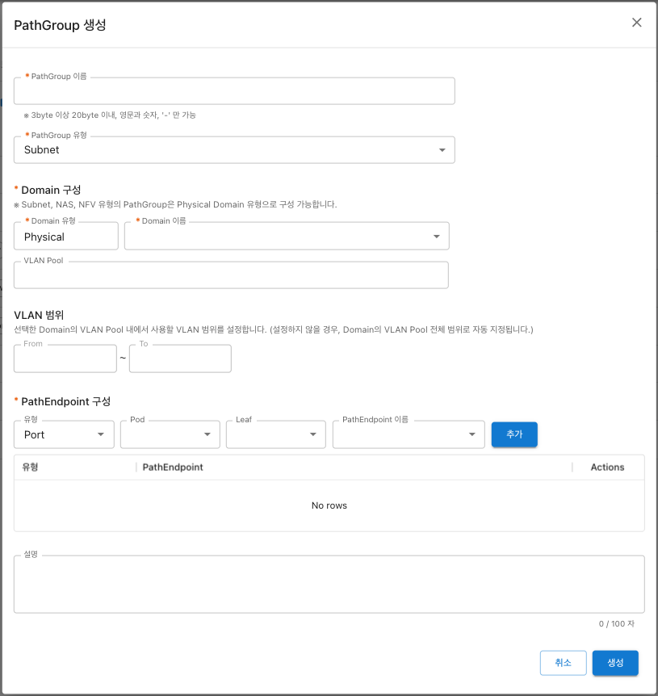

---
layout:
  title:
    visible: true
  description:
    visible: false
  tableOfContents:
    visible: true
  outline:
    visible: true
  pagination:
    visible: true
---

# SDDC Platform

## 소개

SDDC Platform은 SDN, NFV, SDC, SDS 등 가상화 기술을 통해 사용자가 Virtual Data Center를 구축·운영·최적화의 전 라이프사이클을 관리할 수 있는 통합 플랫폼입니다.

## 서비스 구성

SDDC Platform은 다음과 같은 서비스로 구성되어 있습니다.

<table><thead><tr><th width="176.37696335078533">서비스</th><th>설명</th></tr></thead><tbody><tr><td>Dashboard</td><td>Tenant 내에 Server, Storage, Network 등 리소스 현황과 리소스 구성(토폴로지), 사용량 정보 등을 제공합니다.</td></tr><tr><td>Compute</td><td>가상 컴퓨팅 자원 관리 기능을 제공합니다.</td></tr><tr><td>Storage</td><td>가상 스토리지 자원 관리 기능 및 백업을 제공합니다.</td></tr><tr><td>Network</td><td>가상 네트워크를 기반으로 유연하고 빠른 네트워크 구성 기능을 제공합니다.</td></tr><tr><td>NFV</td><td>방화벽, 로드밸런서 등 세분화된 보안 기능을 가상화하여 제공합니다.</td></tr></tbody></table>

## 화면 구성

<figure><figcaption></figcaption></figure>

1. Tenant : Tenant 선택 기능 및 Tenant 단위의 리소스 관리 기능 제공
2. 네비게이션 메뉴 : Tenant와 사용자 권한에 따른 제공 서비스 목록 제공
3. 콘텐츠 : 콘텐츠 영역. 조회/생성/수정/삭제 등의 메뉴별 액션 기능 제공
4. 사이트 : 사이트 선택 기능 제공
5. 알림 : 공지사항, 리소스 액션 결과에 대한 알림 기능 제공
6. 가이드 : 사용자 가이드 기능 제공
7. 공지사항 : 플랫폼 공지사항 기능 제공
8. 마이페이지 : 개인정보 수정 및 로그아웃 기능 제공

## 서비스 특장점

#### Tenant 격리

SDN기반으로 Overlay 네트워크를 생성하여 논리적 격리 개념의 VPC 환경 제공

#### Multiple Subnet

고객 계정 당 최대 3개 VPC, VPC당 15개 Subnet 제공(최대 총 45개 Subnet)

#### IP Overlapping

고객(Tenant)별로 동일한 IP대역 사용 가능(Tenant 내에서는 중복 불가)

#### Network Endpoints

VPC 내부 리소스의 다양한 Endpoint 접근 방식 제공

#### Various Network Design

고객의 요구에 따라 자유로운 네트워크 구성이 가능

#### Single Pane of Glass

단일UI를 통해 컴퓨팅/네트워크/보안 관련 자원 통합 관리
