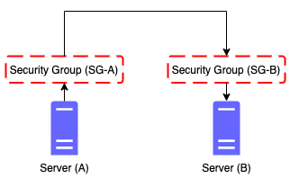

---
layout:
  title:
    visible: true
  description:
    visible: false
  tableOfContents:
    visible: true
  outline:
    visible: true
  pagination:
    visible: true
---

# Security Rule

***

## 개요

Security Rule은 서버에서 발생하는 송신(Egress)/수신(Ingress) 트래픽을 제어함으로써 서버를 안전하게 보호할 수 있습니다.

Security Rule은 stateful 방식으로 동작하며 규칙이 존재할 경우 허용하는 white list 방식인 positive security model 입니다.

### Security Rule 설정 항목

방향, IP 프로토콜, Port, Ether 범위, Remote (원격)로 정책을 설정합니다.

#### Security Rule 예시

* 원격 IP 192.168.1.56에서 TCP 프로토콜을 통해 서버로 들어오는 트래픽을 허용하는 규칙입니다.

| 방향 | IP 프로토콜 | Port | Ether 범위 | Remote (원격)     |
| -- | ------- | ---- | -------- | --------------- |
| 수신 | TCP     | 전체   | IPv4     | 192.168.1.56/32 |

* 서버에서 임의의 프로토콜을 통해 나가는 모든 IPv4의 트래픽을 허용하는 규칙입니다.

| 방향 | IP 프로토콜 | Port | Ether 범위 | Remote (원격) |
| -- | ------- | ---- | -------- | ----------- |
| 송신 | 전체      | 전체   | IPv4     | 0.0.0.0/0   |

* ICMP 프로토콜을 통해192.168.1.0/24 에서 서버로 들어오는 트래픽을 허용하는 규칙입니다.

| 방향 | IP 프로토콜 | 타입 / 코드 | Ether 범위 | Remote (원격)    |
| -- | ------- | ------- | -------- | -------------- |
| 수신 | ICMP    | 0 / 8   | IPv4     | 192.168.1.0/24 |

#### Server를 위한 필수적인 Security Rule

서버 통신을 위한 필수적인 Security Rule들이 다음과 같이 4건이 존재합니다.

필수적인 규칙 4건이 존재하지 않을 때, 서버 통신이 오동작 할 수 있으므로 주의해주시길 바랍니다.

<table><thead><tr><th width="80">방향</th><th width="113">IP 프로토콜</th><th width="64">Port</th><th width="110">Ether 범위</th><th width="186">Remote IP</th><th>설명</th></tr></thead><tbody><tr><td>송신</td><td>TCP</td><td>80</td><td>IPv4</td><td>169.254.169.254/32</td><td>Server에 메타 데이터 제공을 위한 규칙</td></tr><tr><td>송신</td><td>UDP</td><td>67</td><td>IPv4</td><td>0.0.0.0/0</td><td>DHCP 서버와 통신하기 위한 규칙</td></tr><tr><td>송신</td><td>UDP</td><td>68</td><td>IPv4</td><td>0.0.0.0/0</td><td>DHCP 서버와 통신하기 위한 규칙</td></tr><tr><td>송신</td><td>UDP</td><td>53</td><td>IPv4</td><td>DNS server address <em>(Google 8.8.8.8/32)</em></td><td>DNS 서버와 통신하기 위한 규칙</td></tr></tbody></table>

#### 원격 유형 (Remote Group)

<figure><figcaption></figcaption></figure>

Security Rule의 원격 유형을 Remote Group으로 설정 할 수 있습니다.

* 아래는 위의 그림의 예시 입니다.
* Server (A)에 설정된 Security Group (SG-A)

| 방향 | IP 프로토콜 | Port | Ether 범위 | Remote (원격) |
| -- | ------- | ---- | -------- | ----------- |
| 송신 | 전체      | 전체   | IPv4     | SG-B        |

* Server (B)에 설정된 Security Group (SG-B)

| 방향 | IP 프로토콜 | Port | Ether 범위 | Remote (원격) |
| -- | ------- | ---- | -------- | ----------- |
| 수신 | 전체      | 전체   | IPv4     | SG-A        |

## 사용 가이드

### Security Rule 목록 조회

1. Compute > Security Group 버튼을 클릭합니다.
2. 조회할 Security Group을 선택하고, 상단에 **\[SECURITY RULE 관리]** 버튼을 클릭합니다.

<figure><figcaption></figcaption></figure>

1. Security Rule 관리 팝업 창에서 목록을 확인합니다.

<figure><figcaption></figcaption></figure>

### Security Rule 추가

Security Rule을 생성하려면 기본적으로 Security Group이 있어야 합니다. Security Group 생성에자대한세한 사항은 [Security Group](./)을 참고합니다.

1. Compute > Security Group 버튼을 클릭합니다.
2. 수정할 Security Group을 선택하고, 상단에 **\[SECURITY RULE 관리]** 버튼을 클릭합니다.

<figure><figcaption></figcaption></figure>

1. Security Rule 관리 팝업 창에서 목록 오른쪽 상단에 **\[RULE 추가]** 버튼을 클릭합니다
2. 추가할 Rule을 입력 후 **\[저장]** 버튼을 클릭합니다.

<figure><figcaption></figcaption></figure>

### Security Rule 삭제

1. Compute > Sercurity Group 버튼을 클릭합니다.
2. 수정할 Security Group을 선택하고, 상단에 **\[SECURITY RULE 관리]** 버튼을 클릭합니다.

<figure><figcaption></figcaption></figure>

1. Security Rule 관리 팝업 창에서 삭제할 Security Rule에 대해 삭제 버튼을 클릭합니다.
2. 입력이 완료되면 **\[저장]** 버튼을 클릭합니다.

<figure><figcaption></figcaption></figure>

## FAQ

> **Q. 프로토콜을 전체로 선택했을 때, Port 범위를 지정할 수 있나요?**
>
> **A.** 아니요. 프로토콜을 전체로 선택했을 때, Port 범위는 전체로 지정되며 따로 지정할 수 없습니다.

> **Q. Security Group을 생성할 때, 자동으로 생성되는 기본 Security Rule을 수정, 삭제할 수 있나요?**
>
> **A.** 네. Security Group 생성시에는 변경할 수 없지만, 생성 이후에는 기본 Security Rule들을 수정, 삭제 할 수 있습니다.
>
> **Q. Security Rule은 최대 몇 개 까지 생성 가능한가요?**
>
> **A.** 1개의 Security Group에서 30개 까지 Security Rule을 생성 할 수 있습니다.
