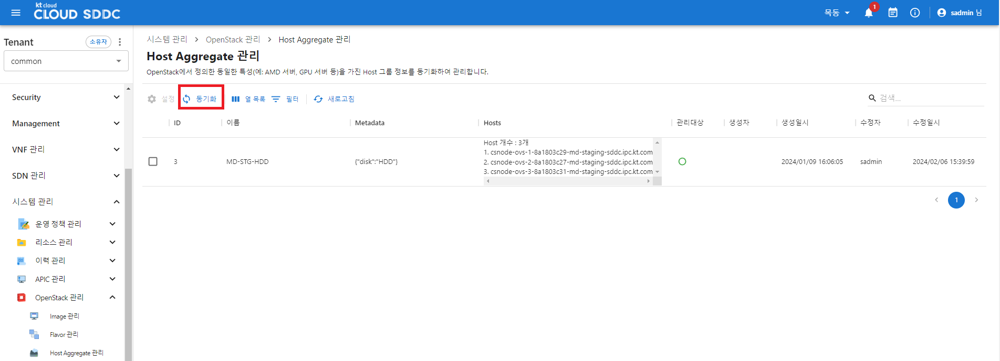

---
layout:
  title:
    visible: true
  description:
    visible: false
  tableOfContents:
    visible: true
  outline:
    visible: true
  pagination:
    visible: true
---

# 모니터링

## 개요

Backend Storage 모니터링 기능을 제공합니다.

제공되는 지표는 Total, Physical Used, Reserved 가 있습니다.

### &#x20;모니터링 조회

<figure><figcaption></figcaption></figure>

## FAQ

> **Q. Compute Node가 하나도 보이지 않아요.**
>
> **A.** [**OpenStack 환경설정**](../openstack/undefined.md)**의 CNode 동기화를 참고하세요**
